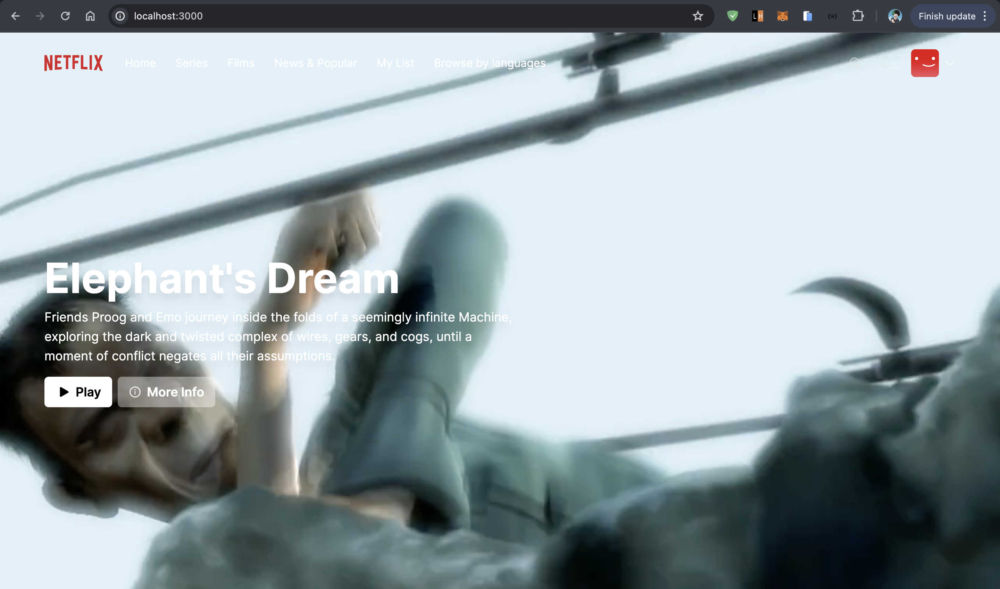
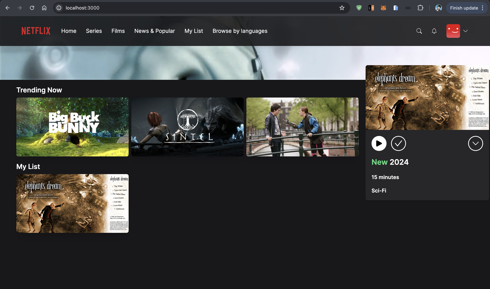
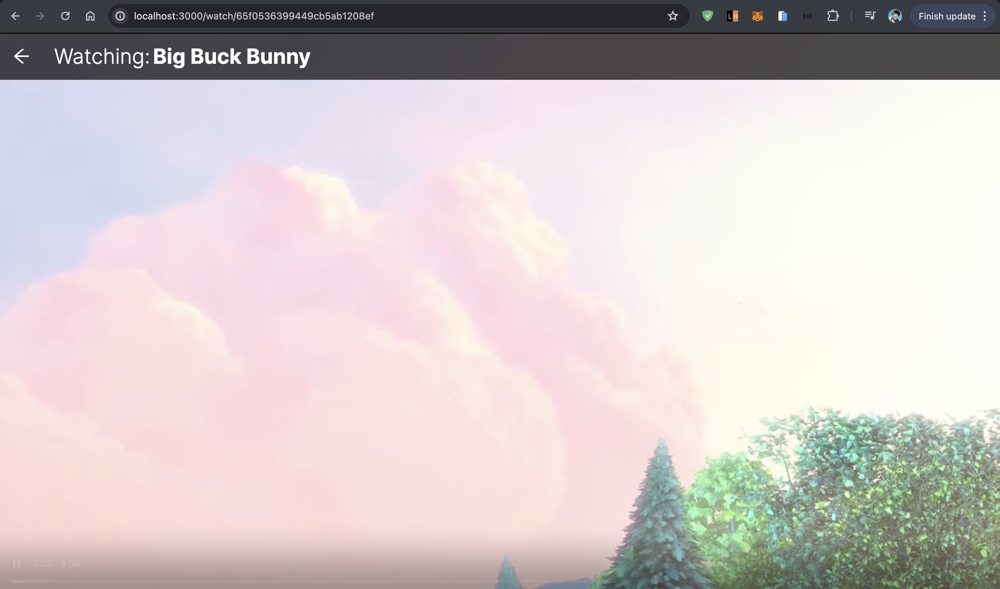
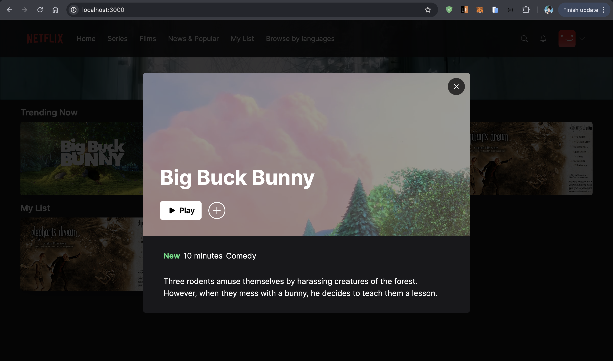
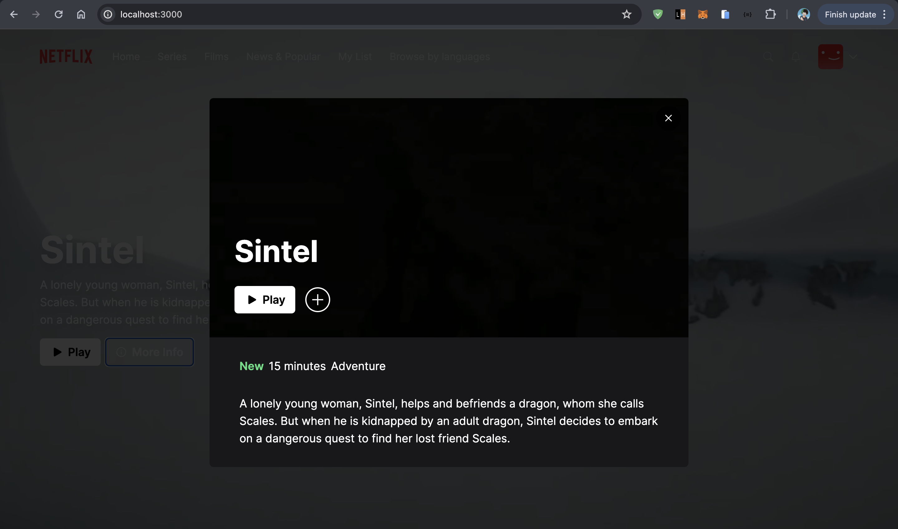

# Netflix clone

## Getting Started

First, run the development server:

```bash
npm run dev

```

Open [http://localhost:3000](http://localhost:3000) with your browser to see the result.

## Tech stack:
 - NextJS14
 - Prism ORM (with mongodb)
 - NextAuth for authentication (google and github oauth providers)
 - Typescript

## Screenshots:
_
_
_
_
_
